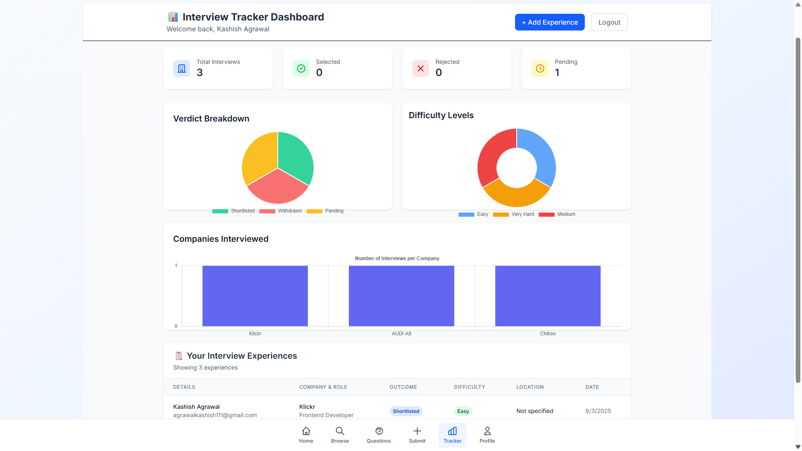

# InsightPrep.ai 🚀

**Your personalized companion for interview preparation**

InsightPrep.ai is a comprehensive interview preparation platform that helps candidates prepare for technical and behavioral interviews through real experiences, practice questions, and progress tracking.

### Home Dashboard

*Main dashboard showing platform statistics and key features*

### Submit Experience

*Interface for sharing interview experiences with the community*

### Browse Questions

*Collection of practice interview questions organized by category*

### Browse Experiences

*Real interview stories and experiences from the community*

### Interview Tracker

*Personal dashboard to track your interview journey and progress*

## ✨ Features

### 📊 **Dashboard Analytics**
- **127+ Interview Experiences** - Learn from real interview stories
- **42+ Active Contributors** - Growing community of job seekers
- **215+ Questions Shared** - Comprehensive question database

### 🎯 **Core Features**

#### 📝 **Submit Experience**
- Share your interview story with the community
- Help others learn from your experience
- Contribute to the growing knowledge base
- Anonymous submission options available

#### 🔍 **Browse Questions**
- Practice real interview questions
- Questions categorized by:
  - Technical skills
  - Behavioral scenarios
  - Company-specific questions
  - Difficulty levels
- Community-contributed content

#### 📚 **Browse Experiences**
- Learn from real interview stories
- Filter by:
  - Company
  - Role
  - Interview type
  - Outcome
- Detailed experience breakdowns

#### 📈 **Interview Tracker**
- Visualize your interview journey
- Track applications and outcomes
- Monitor progress over time

#### 💡 **Quick Tips**
- Contextual advice throughout the platform
- Best practices for interview preparation
- Tips for effective storytelling

## 🛠️ Technology Stack

- **Frontend**: React 19.1.0, Vite, TailwindCSS
- **Backend**: NodeJS, ExpressJS
- **Routing**: React Router DOM 7.6.3
- **Charts**: Chart.js 4.5.0, React Chart.js 2
- **HTTP Client**: Axios 1.10.0
- **Backend**: Express 5.1.0, Node.js
- **Styling**: TailwindCSS 4.1.11, PostCSS, Autoprefixer

## 🚀 Getting Started

### Prerequisites
- Node.js (v16 or higher)
- npm or yarn

### Installation

1. **Clone the repository**
```bash
git clone https://github.com/KashishAgrawal07/InsightPrep.ai.git
cd InsightPrep.ai
```

2. **Install dependencies**
```bash
npm install
```

3. **Start development server**
```bash
npm run dev
```

4. **Build for production**
```bash
npm run build
```

5. **Preview production build**
```bash
npm run preview
```

### Available Scripts

- `npm run dev` - Start development server
- `npm run build` - Build for production
- `npm run preview` - Preview production build
- `npm run lint` - Run ESLint

## 📁 Project Structure

```
InsightPrep.ai/
├── public/                 # Static assets
├── src/                   # Source code
│   ├── components/        # React components
│   ├── pages/            # Page components
│   ├── hooks/            # Custom hooks
│   ├── utils/            # Utility functions
│   ├── styles/           # CSS/Styling files
│   └── App.jsx           # Main App component
├── screenshots/          # Application screenshots
├── package.json          # Dependencies and scripts
├── vite.config.js       # Vite configuration
├── tailwind.config.js   # TailwindCSS configuration
└── README.md            # Project documentation
```

## 🤝 Contributing

We welcome contributions from the community! Here's how you can help:

### Ways to Contribute
1. **Share Interview Experiences** - Add your interview stories
2. **Submit Questions** - Contribute practice questions
3. **Report Bugs** - Help us improve the platform
4. **Feature Requests** - Suggest new features
5. **Code Contributions** - Submit pull requests

### Development Contribution
1. Fork the repository
2. Create a feature branch (`git checkout -b feature/AmazingFeature`)
3. Commit your changes (`git commit -m 'Add some AmazingFeature'`)
4. Push to the branch (`git push origin feature/AmazingFeature`)
5. Open a Pull Request

## 👥 Community & Support

- **GitHub Issues**: Report bugs and request features
- **Discussions**: Share ideas and get help
- **Contributors**: Special thanks to all contributors

## 🌟 Acknowledgments

- Thanks to all interview contributors sharing their experiences
- Community members helping with questions and feedback
- Open source libraries making this project possible

## 📞 Contact

**Project Maintainer**: Kashish Agrawal
**Project Maintainer**: Manasi Sonje

- GitHub: [@KashishAgrawal07](https://github.com/KashishAgrawal07)
- GitHub: [@Manasi-Sonje](https://github.com/Manasi-Sonje)

---

**Made with ❤️ for the job-seeking community**

*Help others succeed in their interview journey by sharing your experiences and insights!*
